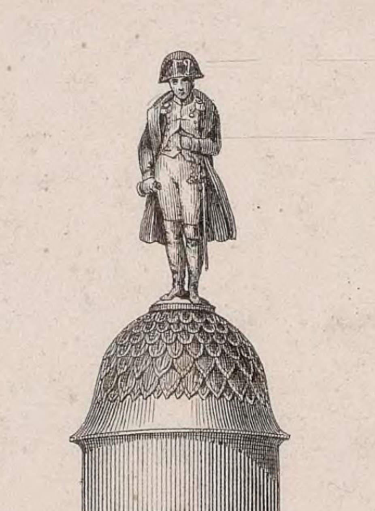

# *La France actuelle et ses anciens défenseurs* (1838). 
## Cartographie et iconographie militariste sous Louis-Philippe 

Ceci est un espace de travail pour le projet de recherche collaboratif entre [Béatrice Denis](https://histart.umontreal.ca/repertoire-departement/doctorants/doctorant/in/in32580/sg/Beatrice%20Denis/) et [Lena Krause](https://lenamk.site) à propros de la Carte *La France actuelle et ses anciens défenseurs* (1838) par Tardieu.

Projet présenté au [RAA19](https://raa19.com/2021/10/31/la-france-actuelle/) le 20 janvier 2022.

### Liens 
- Carte: [Gallica](https://gallica.bnf.fr/ark:/12148/btv1b53083503z)
- [Visualisation interactive](https://lenamk.site/carte1838/viz/)
- [Visuel de la présentation](https://www.canva.com/design/DAE1RltcXjo/hf4mxVvtaPofDm-57xtjeg/view?utm_content=DAE1RltcXjo&utm_campaign=designshare&utm_medium=link&utm_source=sharebutton)

### Références
La recherche effectuée est en ligne sur [Zotero](https://www.zotero.org/groups/4298276/carte1838/library).

Le code est disponible sur [Github](https://github.com/lenaMK/carte1838).

**Pour citer ce travail**: Denis, Béatrice et Lena Krause (2022). « *La France actuelle et ses anciens défenseurs* (1838). Cartographie et iconographie militariste sous Louis-Philippe ». Conférences RAA19, Montréal, 20 janvier 2022. [Accès en ligne](https://lenamk.site/carte1838/)